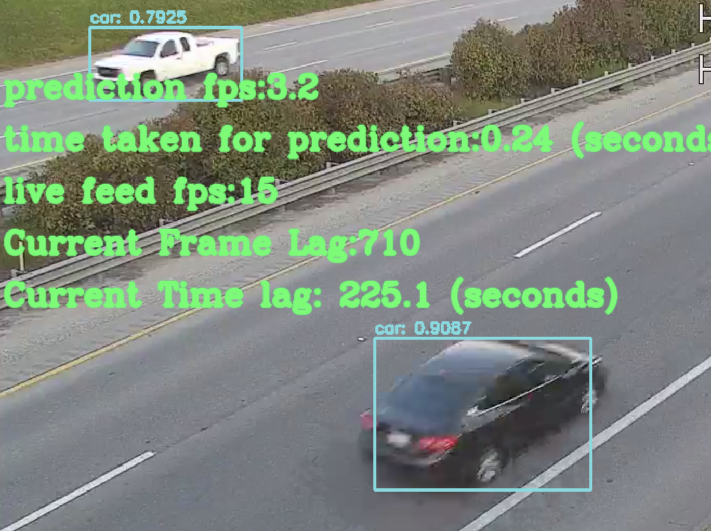

# Live Traffic camera : Classify Vehicular traffic

#### Table of Contents

-   [About this repo](#about_this_repo)
-   [Techstack](#techstack)
-   [Preprocessing](#preprocessing)
-   [Training](#training)
-   [Deployment](#deployment)
-   [Predictions](#predictions)

### About this repo
This repository contains source code, utilities and web application for "Live Image tagging and road object detection". Vehicular objects are detected and classified from a live traffic camera feed.


### Techstack
###### Object Detection Algorithm: Yolo v4
###### Open source object detector : [Alexy AB darknet](https://github.com/AlexeyAB/darknet)
###### Initial Weights file : yolov4.conv.137
###### Deployment: FastAPI in Docker Container 

Model Training
Colab notebook: [driver.ipynb](https://github.com/amit-paradkar/project3AMK2/blob/master/driver.ipynb)
Dataset:BDD 100K dataset

### Preprocessing
- [1. Data Preparation](#datapreparation)
    <ol type="i">
    <li>The images and labels for BDD dataset are not consistent. 
    
    Use Data set cleaning script [clean_images_labels.py](https://github.com/amit-paradkar/project3AMK2/blob/master/pre_processing/clean_images_labels.py) to create images and labels data</li>
    <li>Convert the JSON labels from BDD to text labels required by darknet. 
    
    Use [convert_json_labels_to_txt.py](https://github.com/amit-paradkar/project3AMK2/blob/master/pre_processing/clean_images_labels.py)</li>
    <li>
    
    Use [process.py](https://github.com/amit-paradkar/project3AMK2/blob/master/pre_processing/process.py) for creating train.txt and test.txt file. This script ramdomnly divides the data set into 90% (train) & 10% (test)</li>
    </ol>

- [2. Colab instance Preparation](#colabinstancereparation)
    <ol type="i">
    <li>Use 
    
    [driver.ipynb](https://github.com/amit-paradkar/project3AMK2/blob/master/driver.ipynb) for setting up colab instance</li>
    
    <li>Build darknet. 
    
    Follow instructions in [Alexy AB darknet](https://github.com/AlexeyAB/darknet) to build darknet binary</li>
    
    <li>Create [yolo-obj.cfg]
    
    (https://github.com/amit-paradkar/project3AMK2/blob/master/static/model/configuration/yolo-obj.cfg) and copy it to darknet/cfg folder</li>
    <li>Create [obj.names]
    
    (https://github.com/amit-paradkar/project3AMK2/blob/master/static/model/configuration/obj.names) and obj.data and copy them to darknet/data folder.</li>
    <li>Create a obj.zip containing images and their labels on local</li>
    <li>Uplooad it to colab google drive</li>
    <li>Copy the obj.zip to /home directory in colab instance. This will create /home/obj folder which will contain all images and label files</li>
    <li>Execute command "python process.py" to create train.txt and test.txt files.</li>
    </ol>

### Training

- [1. Model Training](#modeltraining)
    <ol type="i">
    
    <li>Run the command

    ```bash
    !./darknet detector train data/obj.data cfg/yolo-obj.cfg yolov4.conv.137 -dont_show -map 2>&1 | tee darknet.log
    ```
    </li>

    <li>In case the colab session doesn't complete run the command until iterations (max_batch_size) is complete
        
    ```bash
    !./darknet detector train data/obj.data cfg/yolo-obj.cfg /mydrive/yolov4/training/yolo-obj_last.weights -dont_show -map 2>&1 | tee darknet.log
    ```
    </li>
    <li>Check the yolo-chart.png created to verify the loss</li>
    <li>Once training is complete change the following line in yolo-obj.cfg</li>
    
        batch=1
        subdivisions=1
        comment all other lines containing batch and subdivision
    
    <li>Execute the following command 
    
    ```bash
    !./darknet detector test data/obj.data cfg/yolo-obj.cfg /mydrive/yolov4/training/yolo-obj_best.weights /mydrive/yolov4/Validate/0a0a0b1a-7c39d841.jpg -thresh 0.005 -ext_output

    ```
    </li>
    <li>Validate your model based on the "predictions.jpg" file created by step above</li>
    <li>In case predictions are not good, then change the learning_rate in yolo-obj.cfg and run steps #i to #vi</li>
    </ol>
### Deployment
1) Install docker on your local machine
2) In main.py update the variable TRAFFIC_FEED_URL to the feed address
3) Run command "docker build -t project3amk2 .   " to build docker image
4) Run command "docker run 8080:8080 project3amk2" to run the container on your local machine
5) Wait for the FastAPI server starts completely
6) Point your browser to "http://127.0.0.1:5000"

### Predictions

